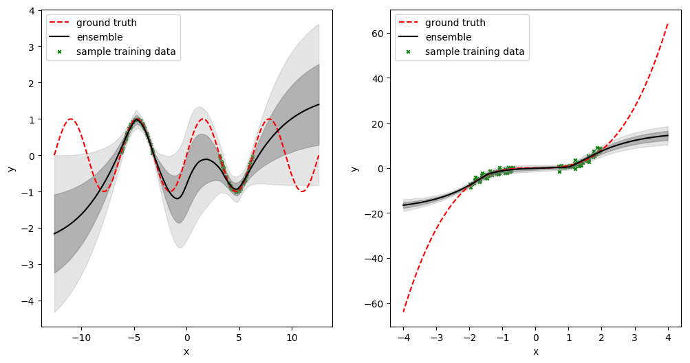
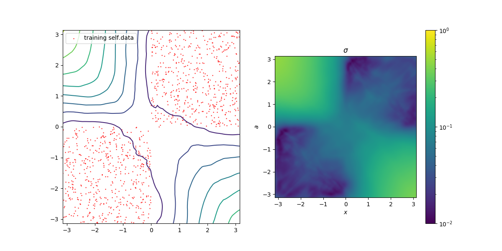
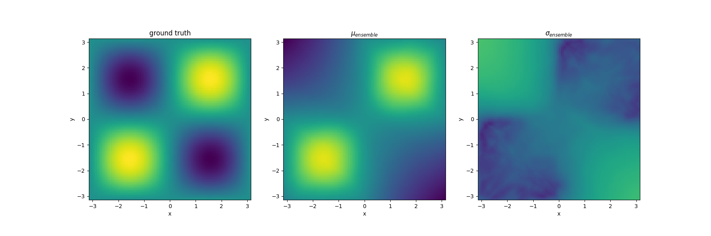

# Probabilistic Network Ensemble 
PyTorch implementations that trains an ensemble of probabilistic neural networks to fit data of toy problems, effectively replicating the results from
* [Lakshminarayanan _et al._, Simple and Scalable Predictive Uncertainty Estimation using Deep Ensembles (2017)](https://papers.nips.cc/paper/7219-simple-and-scalable-predictive-uncertainty-estimation-using-deep-ensembles.pdf)
* [Chua _et al._, Deep Reinforcement Learning in a Handful of Trials using Probabilistic Dynamic Models](https://arxiv.org/abs/1805.12114)

Currently implements three data sets: 
* A simple sine wave `y = sin(x)`
* A simple curve `y = x**3`
* Simple two dimensional system `z = sin(x)cos(y)`


Fig 1: Simple regression. Grey and lighter grey areas show 1 and 2 standard deviations respectively.


Fig 2: Two dimensional regression with clustered training data. _Left_: Contour lines display one standard deviation from the mean, indicating low valued plateau's around the training data. _Right_: Standard deviation in log-scale.

Fig 3: Ground truth, ensemble mean and ensemble standard deviation with the same training data. Notice the mean is accurate where there is training data available, but inaccurate outside. However this is reflected by the increase in standard deviation.

## Requirements
In addition to the standard Python 3 libraries, to run the code you will need:
* PyTorch
* mpi4py

## Executing the code
Executing the code is done through the `run.sh` bash file which requires the script to execute and an optional plotting script. For the 1D and 2D toy problems respectively, please run
```
./run.sh toy_1d.py plot_1d.py
```
and
```
./run.sh toy_2d.py plot_2d.py
```
which trains the network and plots the figures. After training, the output models are stored in the `/data/` directory and can be plotten by simply calling `python plot.py`. Additionally, the plots can be saved with an additional `save` argument, e.g. `python plot.py save` saves the figures in the `/figures/` directory.

### Comments
* Note that the implementation is rather naive and might not work for different data sets, other architectures, different hyperparameters, etc.
* To ignore the parallel computation one can simply run the code with `python toy.py` and increasing the `ensemble_size` to any desired size. This will execute the program on a single core.
* Number of ensembles can be increased by increasing the number of cores within `run.sh`. I have used 4 cores, since my laptop has 4 cores.

For any further questions, please do not hesitate to contact me.
